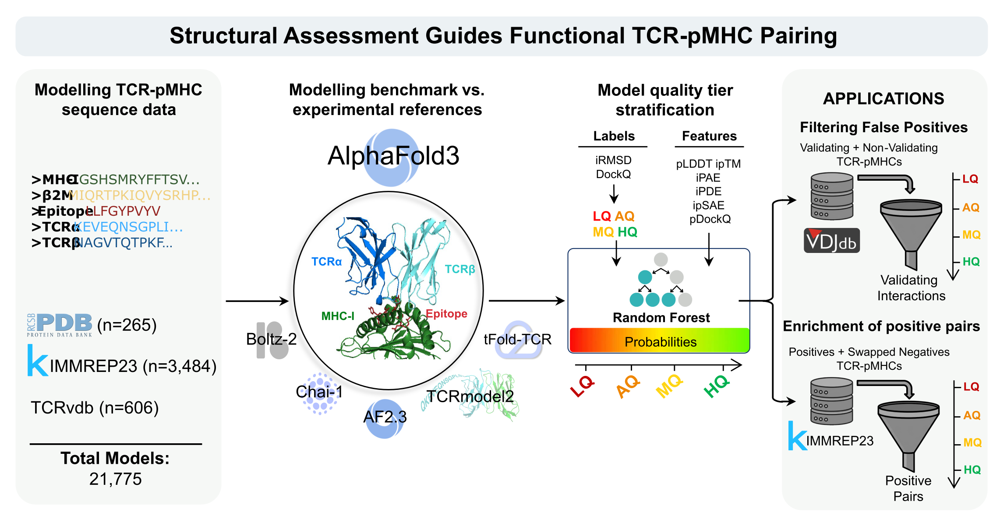

# AF3TCRpMHC



## Overview
This project implements a **complete pipeline for evaluating TCR-pMHC Class I models** generated using AlphaFold3. It allows you to:  

1. Compare modelled vs. reference structures with metrics: iRMSD, TCR-iRMSD, peptide RMSD, MHC iRMSD, CDR3α RMSD, CDR3β RMSD, DockQ score, L-RMSD, Fnat, and clashes.
2. Define four ground truth quality tiers based on model vs. experiemntal reference comparison metrics (TCR-iRMSD and DockQ score): **LQ / AQ / MQ / HQ**. 
3. Calculate model confidence metrics: full-complex pLDDT, CDRα/β-pLDDTs, ipTM, TCR-pMHC ipTM, iPAE, iPDE, ipSAE, and pDockQ scores v1-2. 
4. Derive integrative filters combining model confidence metrics with established thresholds to classify models into **LQ / AQ / MQ / HQ** quality tiers.  
5. Train and evaluate a Random Forest classifier on structural model confidence metrics for model quality tier prediction.  

This repository also includes the data for the benchmarking of protein modelling tools, docking analysis with TCRdock and consensus analisis. 
---

## Installation

It is recommended to create a **Conda** or **virtualenv** environment:

```bash
conda create -n af3_tcrpmhc python=3.12
conda activate af3_tcrpmhc
pip install -r requirements.txt
```

## Requirements

- Python 3.6 or later.

Required Python packages:
- numpy==1.26.4
- pandas==2.3.3
- scikit-learn==1.5.2
- joblib==1.5.2
- biopython==1.85
- anarci==1.3
- pdb-tools==2.5.0
- scipy==1.16.3

## Repository Structure
```bash
./
├── README.md
├── graphical_abstract.png # Visual summary of the pipeline
├── requirements.txt # Project dependencies
├── classifier/ # Trained models
│ └── rf_model_all.pkl
├── data/ # Toy data and results
│ ├── 20250813_PDB_TCRpMHC_classI/
│ ├── 20250813_PDB_models_TCRpMHC_classI/
│ ├── model_confidence_metrics.csv
│ ├── model_vs_reference.csv
│ ├── replica_consensus.csv
│ └── structures_annotation/
├── data_paper/ # Data from the publication
│ ├── AF3_pdb/
│ ├── benchmark/
│ ├── immrep_confidence.csv
│ └── pdb_confidence_and_comparison.csv
├── filters/ # Results of evaluating filters from the publication
│ ├── results_aq_vs_mq.csv
│ └── ...
├── scripts_classification/ # Quality classification scripts
│ ├── filters.py
│ └── random_forest.py
├── scripts_modelling/ # Modeling and structural metric scripts
│ ├── annotate_chains.py
│ ├── caculate_confidence_metrics.py
│ ├── ipsae.py
│ ├── model_vs_reference.py
│ ├── pdockq.py
│ ├── pdockq2.py
│ └── replica_consensus.py
└── src/ # Core project code
├── init.py
├── anarci_utils.py
├── metrics.py
├── mir-1.0-SNAPSHOT.jar
├── rmsd.py
└── utils.py
```

## Usage 

### 1) Model vs. experimental reference comparisons and quality tier assignment
```bash
python model_vs_reference.py --reference_dir ../data/20250813_PDB_TCRpMHC_classI --model_superdir ../data/20250813_PDB_models_TCRpMHC_classI --output ../data/model_vs_reference.csv --workers 1
```

Purpose:
Compare computational TCR-pMHC models against experimental PDB structures and assign a quality tier (LQ, AQ, MQ, HQ) to each model based on structural agreement.

Parameters:
--reference_dir: Folder with experimental PDB structures.
--model_superdir: Folder with AF3 output folders one per experimental reference.
--output: CSV file for saving the comparison results.
--workers: Number of parallel threads to accelerate computation.

Output:
CSV file containing per-model structural comparison metrics and ground truth quality tiers.

### 2) Model confidence scores computation
```bash
python caculate_confidence_metrics.py ../data/20250813_PDB_models_TCRpMHC_classI --output metrics.csv --threshold 70 --workers 1 --fast
```

Purpose:
Calculate confidence metrics for predicted TCR-pMHC models. These metrics evaluate how reliable each model is, e.g., pLDDT, iPTM, iPSAE, PDockQ.

Parameters:
<base_dir> Input directory containing modeled structures.
--output: CSV file to store computed metrics.
--threshold: Threshold used to trim low plddt regions in N and C terminus that can affect interface confidence scores.
--workers: Number of parallel threads.
--fast: if has already been computed ther must be a csv file in each dir, this option avoids recalculation by emrging each metrics_*.csv file.

Output:
CSV file with confidence scores for each model.

### 3) Reference-free quality assignment

#### 3.1) Using filters of confidence metrics (discrete assignment)

##### Explore filters using a 5 fold cross validation setting, derive the best filter using the harmonic mean between specificity and recall and test it in the test set.
```bash
python filters.py --input_csv ../data_paper/pdb_confidence_and_comparison.csv --tiers_negative LQ --tiers_positive AQ MQ HQ --cv
```

Purpose:
Explore all combinations of confidence metrics and logical operators (AND/OR).
Identify the best filter that separates negative vs. positive tiers.
Optimize based on the harmonic mean of specificity and recall.

Parameters:
--input_csv: Path to the CSV file containing model confidence metrics and reference quality labels.
--tiers_negative: Tier(s) considered negative for evaluation (e.g., LQ).
--tiers_positive: Tier(s) considered positive for evaluation (e.g., AQ MQ HQ).
--cv: Flag to run 5-fold cross-validation

Output:
CSV with all evaluated filters in the training sets: ../filters/filter_<tiers_negative>_<tiers_positive>.csv
Evaluation CSV of the best filter on the test sets: ../filters/eval_<tiers_negative>_<tiers_positive>.csv

##### Apply pre-defined filters to assign predicted quality
```bash
python filters.py \
    --input_csv ../data/model_confidence_metrics.csv \
    --metrics "[('cdr1a_plddt','cdr3a_plddt','cdr1b_plddt','cdr2b_plddt','cdr3b_plddt','ipsae','iptm_tcrpmhc','pdockq','avgpdockq2'), ('plddt','cdr1a_plddt','cdr2a_plddt','cdr3a_plddt','cdr1b_plddt','cdr2b_plddt','cdr3b_plddt','ipsae','iptm_tcrpmhc','avgpdockq2'), ('plddt','cdr1a_plddt','cdr2a_plddt','cdr3a_plddt','cdr2b_plddt','cdr3b_plddt','iptm_mean')]" \
    --operators "[('AND','AND','AND','AND','OR','OR','AND','OR'), ('OR','AND','OR','AND','OR','OR','OR','OR','OR'), ('OR','AND','OR','AND','AND','AND')]" \
    --test 
```

Purpose:
Apply 3 predefined filters on model confidence metrics.
Assign predicted quality labels: LQ, AQ, MQ, HQ.
Logical operators define how multiple metrics are combined (AND/OR).

parameters:
--input_csv: CSV file containing model confidence metrics.
--metrics: List of tuples specifying the metrics for each filter.
--operators: List of tuples specifying logical operators between metrics in each filter.
--test: Flag to apply filters on the dataset instead of exploring.

Output:
CSV with predicted quality per model: ../filters/predicted_qualities.csv


#### 3.2) Using random forest classifier (continuous assignment)
```bash
python random_forest.py --train ../data_full/pdb_confidence_and_comparison.csv --test ../data/model_confidence_metrics.csv --output ../classifier/predictions.csv --save_model ../classifier/rf_test.pkl
```
Purpose:
Train a Random Forest classifier on reference models.
Predict continuous quality scores for new models.
Save trained model for later use.

Parameters:
--train: CSV file containing reference models with confidence metrics and quality labels.
--test: CSV file of models to predict.
--output: CSV file to save predictions.
--save_model: Path to save the trained Random Forest model for reuse.

Output:
CSV file with predicitons on the test set, if no test set is provided predictions on training set.

```bash
python random_forest.py --test ../data/model_confidence_metrics.csv --output ../classifier/predictions.csv
```

Purpose:
Apply a pre-trained Random Forest model ("./classifier/rf_model_all.pkl") trained on all PDB model vs. structure comparisons to assign quality predictions to new models.

Parameters:
--test: CSV file containing models to predict.
--output: CSV file to save predictions.

Output:
CSV with predicted continuous quality scores for each model:
../classifier/predictions.csv